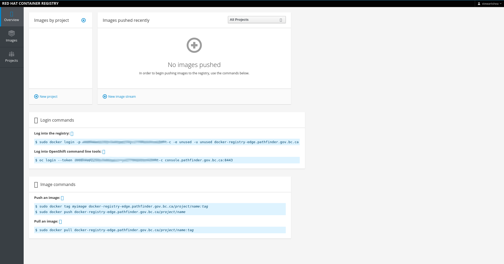

# Interacting with the Registry Console
The registry console provides a web based interface to view the container images created for your projects. It can
be used to obtain information on how to push/pull to the registry (from your local machine), as well as setting access
rights on your project images. 


### Accessing the Registry Console
The registry console can be accessed at [https://registry-console-default.pathfinder.gov.bc.ca](https://registry-console-default.pathfinder.gov.bc.ca). 

- From the browser, navigate to the [registry console](https://registry-console-default.pathfinder.gov.bc.ca) and login if required


### Viewing the Registry Push/Pull Commands
Navigate to the bottom of the `Overview` tab to find your specific docker login commands. These can be used if you wish to push 
images into your project space. 



### Viewing Image Details
Navigate to the Images tab, select the correct project, and explore the image details. Also nagivate to the Web Console and explore `Builds -> Images` 
to see similar details. 


### Adding an Image Tag
In preparation for deployment to our dev environment, we will tag the latest version of our image with the tag `dev`. 

- From the CLI

```
oc tag rocketchat-[username]:latest rocketchat-[username]:dev
```

- In the Registry Console, notice that the tag has now been added: 


- From the CLI

```
oc get imagestreams
```

### Changing Project Image Permissions
- Navigate to the Projects tab of the registry console and notice that the security for the project can be changed with the edit icon


- Or individual members / service account access can be added


- Notice that the change is reflected in the Web Console


