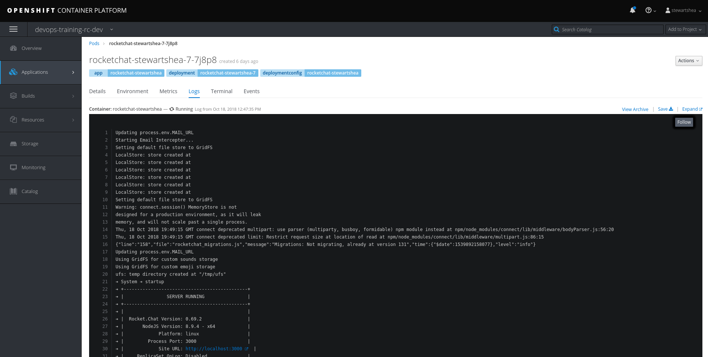

# Debugging Containers

### Accessing Local Logs
Logs of a running pod can be accessed from the Web Console or from the `oc` cli: 

- The `Logs` tab of any running pod can be used to view active logs for the current pod



- The `oc` command can be used to view or tail the logs: 

```
oc logs -f <pod name>
```
If there is more than one container in a given pod, the `-c <container-name>` switch is used to specify the desired container logs. 

### Using a Debug Container

#### From the Web Console
In this lab, edit yaml of the `mongodb-[username]` deployment config. 
- Under `spec` and `containers`, locate the line:  
    ```
              name: mongodb
    ```
- Insert the following line at the same indent level:
    ```
              command: ["touch test"]
    ```
- Once the deployment change takes effect, notice the CrashLoopBackoff


- Click on `Debug container`
- Explore your capabilities within this container
- Once done, remove the previously added command, and notice how its placement and structure changed. 

#### From the CLI
Using the `oc` command, start a debug container. 

- Find the name of a pod you would like to debug 

```
oc get pods 
```

- Run the `oc debug` command to start a debug pod (your output will vary)

```
$ oc debug mongodb-1-s74g8
Defaulting container name to mongodb.
Use 'oc describe pod/mongodb-1-s74g8-debug -n crash-test' to see all of the containers in this pod.
Debugging with pod/mongodb-1-s74g8-debug, original command: container-entrypoint run-mongod
Waiting for pod to start ...
Pod IP: 10.131.22.12
If you don't see a command prompt, try pressing enter.
sh-4.2$ 
sh-4.2$ 
sh-4.2$ exit
exit

Removing debug pod ...
```


### RSH and RSYNC
RSH is available to all normal pods through the web console under the `Terminal` tab, as well as through the 
`oc rsh` command. 

- With your choice of access, rsh into one of the application pods and test access within the namespace
    - cURL internal and external resources
    - Test internal name resolution, external name resolution, etc. 
    - Explore your userid

RSYNC is also available in many pods, available through the `oc rsync` command. 
- On the CLI, type `oc rsync -h` 
- Using this command, copy the contents of the mongo data directory to your local machine, or from your machine to the remote pod


### Port Forwarding
The `oc port-forward` command enables users to forward remote ports running in the cluster
into a local development machine. 

- Find your pod and use the port forward command

```
oc get pods  | grep rocketchat-[username]
oc port-forward -p [pod name from above] 8000:3000
```

- Navigate to http://127.0.0.1:8000
