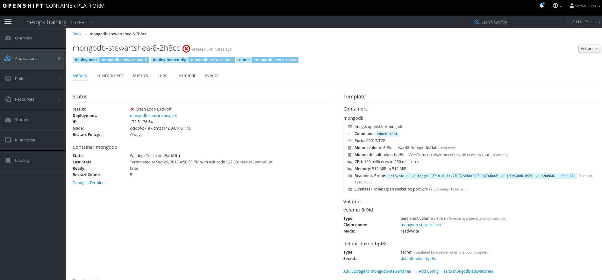

# Debugging Containers

### Using a Debug Container
In this lab, edit the `mongodb-[username]` deployment config. 
- Under `spec` and `containers`, locate the line:  
    ```
              name: mongodb
    ```
- Insert the following line at the same indent level:
    ```
              command: ["touch test"]
    ```
- Once the deployment change takes effect, notice the CrashLoopBackoff



- Click on `Debug container`
- Explore your capabilities within this container
- Once done, remove the previously added command, and notice how its placement and structure changed. 


### RSH and RSYNC
RSH is available to all normal pods through the web console under the `Terminal` tab, as well as through the 
`oc rsh` command. 

- With your choice of access, rsh into one of the application pods and test access within the namespace
    - cURL internal and external resources
    - Test name resolution etc. 

RSYNC is also available in many pods, available through the `oc rsync` command. 
- On the CLI, type `oc rsync -h` 
- Using this command, copy the contents of the mongo data directory to your local machine, or from your machine to the remote pod


### Port Forwarding
The `oc port-forward` command enables users to forward remote ports running in the cluster
into a local development machine. 

- Find your pod and use the port forward command

```
oc get pods  | grep rocketchat-[username]
oc port forward -p [pod name from above] 8000:3000
```

- Navigate to http://127.0.0.1:8000
